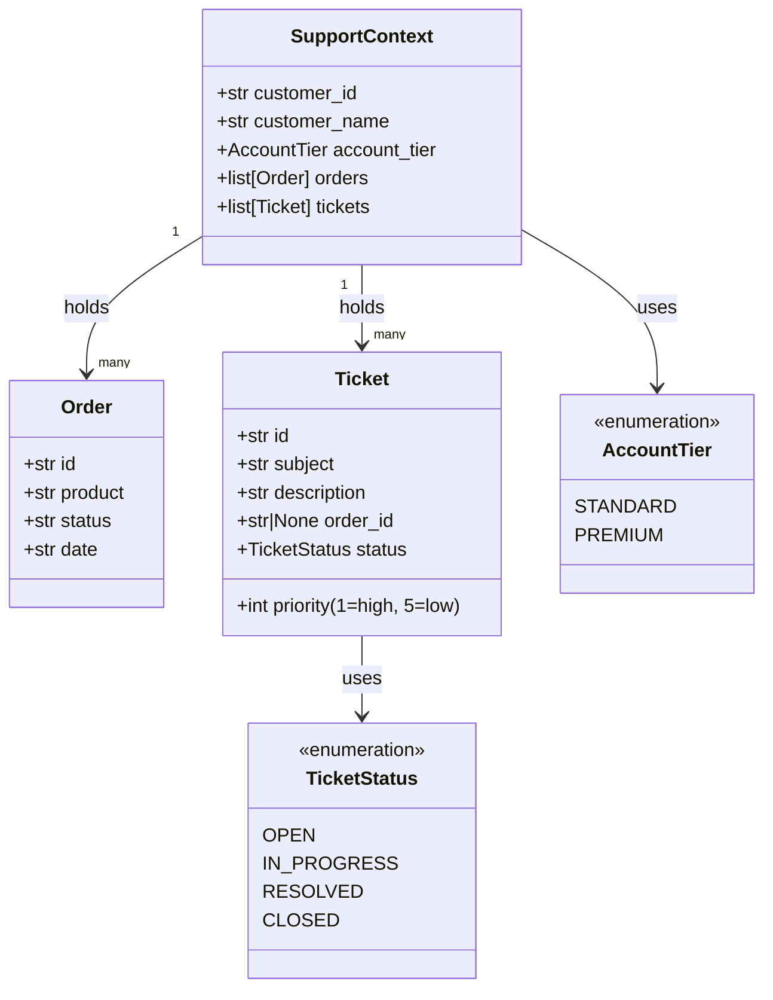
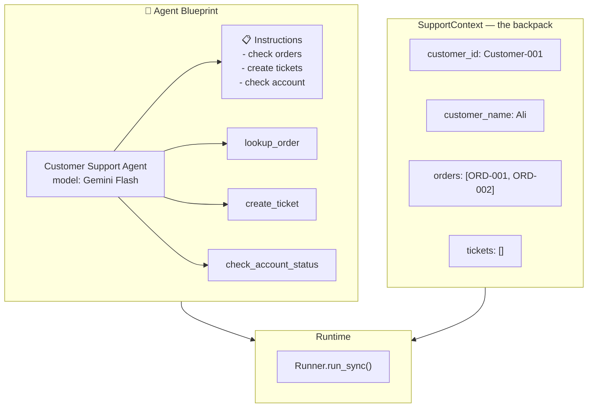
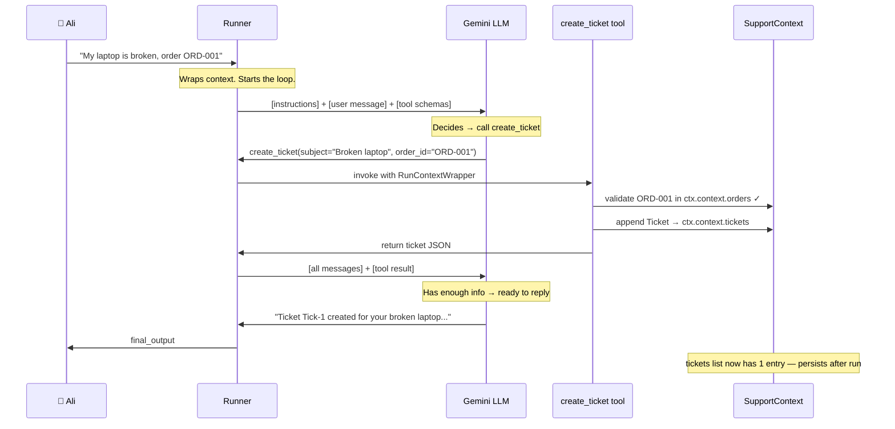

# Support Desk Agent — Visual Walkthrough

**Chapter 34 — OpenAI Agents SDK**
**File:** `openai-agents-sdk/01_support_desk_assistant.py`

> Read the diagram. Understand the system. Then read the code.

---

## What You Will Learn

- How a real agent file is structured in 4 layers
- How data models, tools, agent, and runner connect to each other
- What actually happens at runtime when `Runner.run_sync()` is called
- Why the context object is invisible to the LLM but essential to your tools
- How to read an agent codebase before reading a single line of code

---

## The 4 Layers of Every Agent File

<!-- _class: invert small -->

Before reading the code — understand the layers it is built from.

| Layer | What It Is | In This File |
|-------|-----------|--------------|
| **1. Data Models** | The shapes of data — what exists and what is valid | `Order`, `Ticket`, `TicketStatus`, `AccountTier`, `SupportContext` |
| **2. Tools** | Functions the agent can call — its hands | `lookup_order`, `create_ticket`, `check_account_status` |
| **3. Agent** | The blueprint — instructions + tools wired together | `support_agent` |
| **4. Runtime** | Execution — Runner runs the loop, context flows through | `Runner.run_sync()` + `SupportContext` instance |

> **Rule:** Always understand the layers before reading line by line.
> Layers 1 and 2 are defined first in code. Layers 3 and 4 use them.

---

## Layer 1 — Data Models (Diagram First)

<!-- _class: invert small -->

This diagram shows all the data shapes and how they relate.
Read this before looking at any tool code.



---

## Layer 1 — What the Diagram Tells You

<!-- _class: invert small -->

**`SupportContext` is the backpack.** It holds everything about one customer's session.

**`Order` and `Ticket` are stored inside it.** Tools read and write to these lists.

**Enums prevent invalid values.**

```python
# Without enum — a typo silently causes wrong behavior
ticket.status = "opn"           # No error. Wrong value. Bug.

# With StrEnum — Python raises an error immediately
ticket.status = TicketStatus.OPEN     # Only valid values allowed
```

**`Ticket.priority` is validated by Pydantic:**

```python
priority: int = Field(
    default=5,
    ge=1,   # greater than or equal to 1
    le=5,   # less than or equal to 5
)
# Ticket(priority=10) → raises ValidationError immediately
```

> **Key insight:** Data models are your first line of defence.
> They reject bad data before it ever reaches your tools.

---

## Layer 2 + 3 — System Architecture (Diagram First)

<!-- _class: invert small -->

This shows what exists at startup — before any user message arrives.



---

## Layer 2 + 3 — What the Diagram Tells You

**The Agent is a blueprint.** No API call happens when you write `Agent(...)`.
The API call only happens when `Runner.run_sync()` is called.

```python
# This costs $0 — no API call yet
support_agent = Agent[SupportContext](
    name="Customer Support Agent",
    instructions=instructions,
    tools=[lookup_order, create_ticket, check_account_status],
    model=gemini_model,
)

# This triggers the API call
result = Runner.run_sync(
    starting_agent=support_agent,
    input="My laptop is broken...",
    context=support_context_1,   # <-- the backpack handed to every tool
)
```

> **Ask yourself:** Why does the agent need `[SupportContext]` in `Agent[SupportContext]`?
> Answer: So your IDE can autocomplete `ctx.context.customer_name` inside every tool.

---

## Layer 4 — Runtime Sequence (The Most Important Diagram)

<!-- _class: invert small -->

This is what actually happens when `Runner.run_sync()` is called.



---

## Runtime — What the Sequence Tells You

<!-- _class: invert small -->

Three things the diagram reveals that are easy to miss reading the code:

**1. The LLM never sees the context directly.**
The LLM only sees what tools return to it as strings.
Your `SupportContext` object lives entirely in Python — private.

**2. The LLM decides which tool to call and when.**
You do not write `if "broken" in message: call create_ticket`.
The agent reads the instructions and the tool docstrings and decides itself.

**3. Context changes persist across tool calls within one run.**
If `lookup_order` reads `orders` and `create_ticket` writes to `tickets`,
both are working on the **same backpack**. Changes accumulate.

```python
# After run_sync completes — inspect what happened
print(support_context_1.tickets)
# [Ticket(id='Tick-1', subject='Broken laptop', status=<OPEN>, priority=5)]

# The context object is still alive — your code can read or save it
```

---

## Now the Code — Layer 1: Data Models

<!-- _class: invert small -->

```python
from enum import StrEnum
from pydantic import BaseModel, Field

class TicketStatus(StrEnum):        # enum = fixed set of valid values
    OPEN = "open"
    IN_PROGRESS = "in_progress"
    RESOLVED = "resolved"
    CLOSED = "closed"

class Ticket(BaseModel):
    id: str
    subject: str
    description: str
    order_id: str | None = None     # optional — not all tickets have an order
    status: TicketStatus = Field(
        default=TicketStatus.OPEN,
        description="The status of the ticket."
    )
    priority: int = Field(
        default=5,
        ge=1, le=5,                 # Pydantic rejects values outside 1–5
        description="1 is highest, 5 is lowest."
    )

class SupportContext(BaseModel):    # the backpack
    customer_id: str
    customer_name: str
    account_tier: AccountTier = Field(default=AccountTier.STANDARD)
    orders: list[Order] = Field(default_factory=list)
    tickets: list[Ticket] = Field(default_factory=list)  # starts empty
```

---

## Now the Code — Layer 2: Tools

<!-- _class: invert small -->

```python
from agents import function_tool, RunContextWrapper

@function_tool
def lookup_order(ctx: RunContextWrapper[SupportContext], order_id: str) -> str:
    """
    Lookup an order by its ID.
    Args:
        order_id: The order ID (eg: ORD-001)
    Returns:
        Order details including id, product, status and date.
    """
    for order in ctx.context.orders:        # read from backpack
        if order.id == order_id:
            return order.model_dump_json()  # return as JSON string to LLM
    return f"Order with ID: {order_id} not found."

@function_tool
def create_ticket(
    ctx: RunContextWrapper[SupportContext],
    subject: str, description: str,
    order_id: str | None = None, priority: int = 5,
) -> str:
    """Create a support ticket..."""
    if order_id is not None:
        if not any(o.id == order_id for o in ctx.context.orders):
            return f"Order {order_id} not found for this customer."
    ticket_id = f"Tick-{len(ctx.context.tickets) + 1}"
    ticket = Ticket(id=ticket_id, subject=subject,
                    description=description, order_id=order_id, priority=priority)
    ctx.context.tickets.append(ticket)      # write to backpack
    return ticket.model_dump_json()
```

---

## Now the Code — Layer 3 + 4: Agent and Runner

```python
from agents import Agent, Runner

support_agent = Agent[SupportContext](
    name="Customer Support Agent",
    instructions=instructions,              # the system prompt string
    tools=[lookup_order, create_ticket, check_account_status],
    model=gemini_model,                     # Gemini via OpenAI-compatible API
)

# Create the context (the backpack) — pre-loaded with Ali's data
support_context_1 = SupportContext(
    customer_id="Customer-001",
    customer_name="Ali",
    orders=[
        Order(id="ORD-001", product="Laptop Pro", status="delivered", date="2026-02-10"),
        Order(id="ORD-002", product="Mouse",      status="in transit", date="2026-02-23"),
    ],
)

# Hand the backpack to the Runner — it passes it to every tool call
result_1 = Runner.run_sync(
    starting_agent=support_agent,
    input="create a ticket for my laptop it is broken. order id is ORD-001",
    context=support_context_1,
)

print(result_1.final_output)
```

---

## Common Mistakes

<!-- _class: invert small -->

| Mistake | Wrong | Correct |
|---------|-------|---------|
| Forgetting `ctx` as first param | `def lookup_order(order_id: str)` | `def lookup_order(ctx: RunContextWrapper[...], order_id: str)` |
| Missing docstring | `def create_ticket(...)` with no docstring | Always write a docstring — the LLM reads it to decide when to call the tool |
| Using a plain string for status | `ticket.status = "opn"` | `ticket.status = TicketStatus.OPEN` — let the enum prevent typos |
| Putting context in instructions | `instructions = f"Customer: {name}"` | Put user data in `SupportContext` — not in the instructions string |
| Creating context inside the tool | `ctx = SupportContext(...)` inside a tool | Context is created by YOU before `Runner.run_sync()` — never inside a tool |
| Calling `model_dump_json()` on context | Returning `ctx.context` directly | Tools must return a **string** — use `.model_dump_json()` to serialize Pydantic models |

---

## Try It Yourself

<!-- _class: invert small -->

**Exercise 1 — Read the Sequence ⭐**
Look at the sequence diagram. What does the LLM receive in its second call?
Write your answer in one sentence before checking the diagram again.

**Exercise 2 — Add a Tool ⭐⭐**
Add a `list_orders` tool that returns all orders for the current customer.
It reads from `ctx.context.orders` and returns a formatted string.
Test it with: `"Show me all my orders"`

**Exercise 3 — Add a Field ⭐⭐**
Add a `notes: str = ""` field to `Ticket`.
Update `create_ticket` to accept an optional `notes` parameter and store it.
Verify Pydantic rejects a `Ticket` with `priority=10`.

**Exercise 4 — Trace the Flow ⭐⭐⭐**
Run the file. Then add `print(support_context_1.tickets)` after `run_sync`.
What does it print? Does the context survive after the run?

**Think about it:** If you run `Runner.run_sync()` twice with the same `support_context_1`,
what happens to `ctx.context.tickets` on the second run?

---

## Quick Reference

<!-- _class: invert small -->

| Concept | One-liner |
|---------|-----------|
| `BaseModel` | Pydantic model — validates types and field constraints automatically |
| `StrEnum` | Enum of string values — prevents invalid status/tier values |
| `Field(ge=1, le=5)` | Pydantic constraint — rejects values outside 1–5 at creation time |
| `Field(default_factory=list)` | Correct way to default a list in Pydantic — never `= []` directly on class |
| `@function_tool` | Decorator that turns a function into an LLM-callable tool |
| `RunContextWrapper[T]` | SDK container — first param in every context-aware tool, injected automatically |
| `ctx.context` | Your `SupportContext` object — read and write agent state here |
| `.model_dump_json()` | Serialize a Pydantic model to a JSON string — use this to return data to the LLM |
| `Agent[SupportContext]` | Generic annotation — IDE autocomplete only, no runtime effect |
| `Runner.run_sync()` | Runs the agent loop synchronously — blocks until final answer |
| Context after run | The context object persists after `run_sync` — inspect it to see what happened |

---

## What's Next

**Lesson 3 — Agents as Tools & Multi-Agent Orchestration**

This support desk agent handles everything itself.
In Lesson 3 you will split it into specialists:
a triage agent that routes, a billing agent, and a technical agent —
each focused on one job, orchestrated by the triage agent.

> **Preparation question:** Right now the support agent handles orders, tickets,
> and account checks. If you had to split these into 3 separate agents,
> how would you decide which agent handles which tool?
