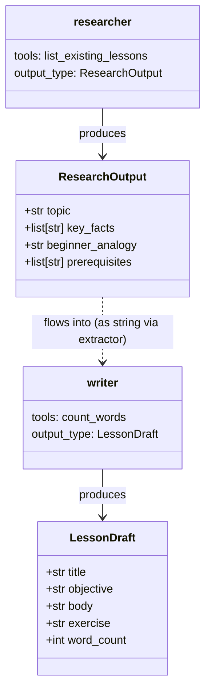
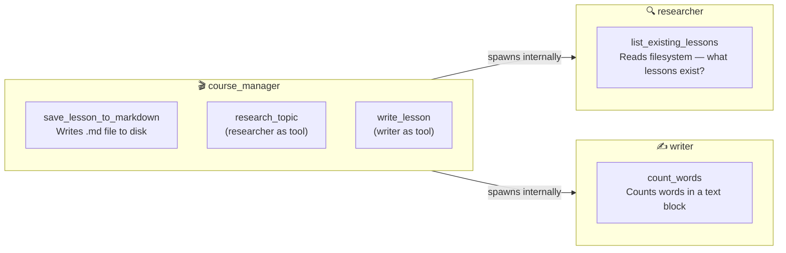
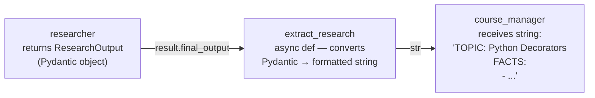
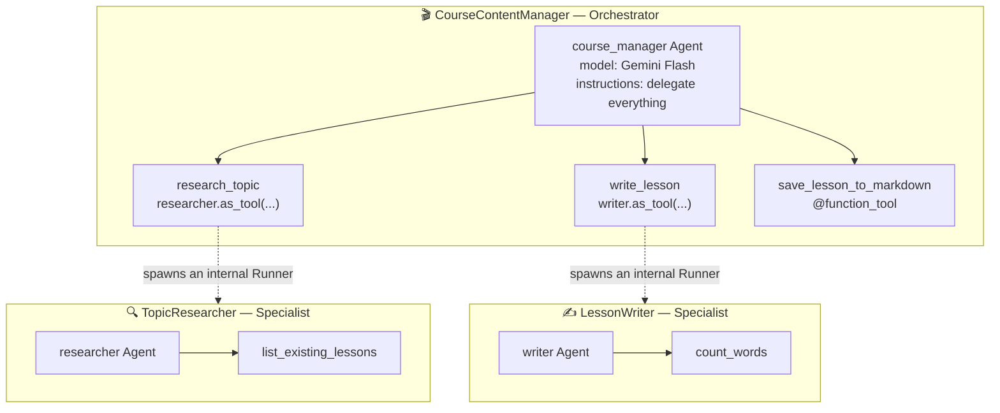
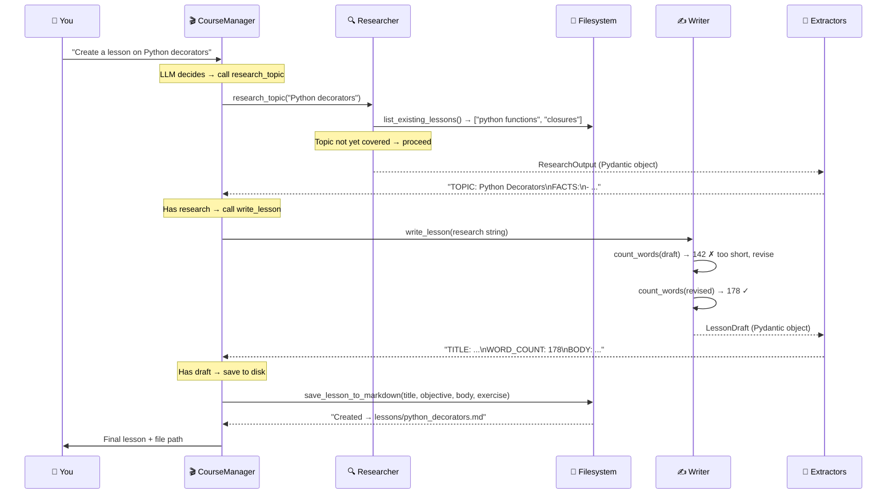

# Agents as Tools — Visual Walkthrough

**Chapter 34 — OpenAI Agents SDK · Lesson 3**
**File:** `openai-agents-sdk/03_agents_as_tools_updated.py`

> A single agent does everything itself.
> A multi-agent system delegates. This lesson teaches you how.

---

## The Film Studio Analogy

<!-- _class: invert small -->

Read this analogy first. Every diagram in this guide maps back to it.

| Film Studio | This Code |
|-------------|-----------|
| **Studio Executive** | You — the one who sends the request |
| **Director** | `course_manager` — orchestrates, never holds the camera |
| **Script Researcher** | `researcher` — checks the archive, gathers facts |
| **Screenwriter** | `writer` — writes the actual lesson |
| Archive Catalog | `list_existing_lessons` — what films already exist? |
| Word Count Checker | `count_words` — script must be 150–200 words |
| Print & Publish | `save_lesson_to_markdown` — final delivery |
| Research Brief | `ResearchOutput` — typed data from researcher |
| Script Draft | `LessonDraft` — typed data from writer |

> **The Director's rule:** A great Director never writes the script themselves.
> They describe what they need, delegate to a specialist, and review the result.
> `course_manager` works exactly the same way.

---

## What You Will Learn

- How to turn an agent into a **callable tool** another agent can use (`as_tool()`)
- Why the orchestrator **never sees sub-agents** — only their output strings
- How **Pydantic structured outputs** flow through async extractors to the manager
- Why each specialist has **its own tools** — and how to decide who owns what
- The difference between **Agents as Tools** and **Handoffs** — when to use each
- How **file persistence** belongs in a `@function_tool`, not in top-level script code

---

## The 4 Layers of a Multi-Agent System

<!-- _class: invert small -->

| Layer | What It Is | In This File |
|-------|-----------|--------------|
| **1. Data Models** | Typed shapes — what specialists produce and return | `ResearchOutput`, `LessonDraft` |
| **2. Function Tools** | Real-world actions agents can take | `list_existing_lessons`, `count_words`, `save_lesson_to_markdown` |
| **3. Agents** | Blueprints — two specialists + one orchestrator | `researcher`, `writer`, `course_manager` |
| **4. Runtime** | Execution — Runner + extractors bridge everything together | `Runner.run_sync()`, `extract_research`, `extract_draft` |

> **New in Lesson 3:** Layer 3 has TWO kinds of agent:
> - **Specialist** — does one job, owns specific tools, returns structured Pydantic data
> - **Orchestrator** — calls specialists via `agent.as_tool()`, owns the final output

---

## Layer 1 — Data Models (Read This First)

<!-- _class: invert small -->

These are the **typed handoffs** between agents. Like a research brief handed to a screenwriter.



---

## Layer 1 — What the Models Tell You

<!-- _class: invert small -->

**`ResearchOutput` is the Research Brief.** All four fields are mandatory — the manager cannot proceed without them.

```python
class ResearchOutput(BaseModel):
    topic: str
    key_facts: list[str]      # 3-5 facts — the raw material for the lesson
    beginner_analogy: str     # the teaching hook — what makes it click
    prerequisites: list[str]  # NEW: what to teach FIRST before this topic
```

**`LessonDraft` is the Script Draft.** `word_count` is not cosmetic — it forces the writer to call `count_words` and report the verified number.

```python
class LessonDraft(BaseModel):
    title: str
    objective: str    # "By the end, students will be able to..."
    body: str         # 150-200 words — verified by the tool, not estimated
    exercise: str     # one hands-on task students run immediately
    word_count: int   # writer MUST call count_words first, then put the real number here
```

> **Ask yourself:** Why put `word_count` as a model field instead of just telling the writer
> "keep it under 200 words" in the instructions?
> A field is **enforceable by Pydantic**. An instruction is just a suggestion the LLM can ignore.

---

## Layer 2 — Function Tools and Who Owns Them

<!-- _class: invert small -->

Each tool belongs to ONE agent — the one whose job requires it.



**Ownership rule — think before assigning:**
- Researcher owns filesystem **read** — it checks what already exists before starting work
- Writer owns the **metric tool** — it validates its own output before returning
- Orchestrator owns filesystem **write** — final delivery is the manager's responsibility

---

## Layer 3 — The Extractor Bridge

<!-- _class: invert small -->

**The hardest concept in this lesson.** A sub-agent with `output_type` returns a Pydantic object. But a tool can only return a `str`. The extractor is the bridge.



**Three rules you cannot break:**

```python
# ✅ CORRECT — async, full annotation, returns str
async def extract_research(result: RunResult | RunResultStreaming) -> str:
    r: ResearchOutput = result.final_output  # typed access — no dict parsing
    facts = "\n".join(f"- {f}" for f in r.key_facts)
    prereqs = ", ".join(r.prerequisites) if r.prerequisites else "None"
    return f"TOPIC: {r.topic}\nPREREQUISITES: {prereqs}\nFACTS:\n{facts}"

# ❌ WRONG — sync function. Fails at runtime with a type error.
def extract_research(result: RunResult | RunResultStreaming) -> str: ...
```

> Rule 1: `async def` — not optional, SDK enforces it
> Rule 2: Full type annotation on `result` — required for registration
> Rule 3: Return `str` — the orchestrator LLM reads it as plain text

---

## Layer 4 — System Architecture at Startup

<!-- _class: invert small -->

This shows the structure **before any user message arrives**. Sub-agents are registered as tools on the manager.



> Dashed arrows = invisible to the user. The sub-agents never appear in the final output.

---

## Layer 4 — Runtime Sequence (The Most Important Diagram)

<!-- _class: invert small -->

What actually happens when `Runner.run_sync(course_manager, "Create a lesson on Python decorators")` is called.



---

## Runtime — What the Sequence Tells You

<!-- _class: invert small -->

**Three insights that are easy to miss when reading the code:**

**1. The orchestrator is also an LLM making decisions.**
`course_manager` reads its instructions and decides which tool to call next and in what order.
It is not a Python function calling other functions — it is an AI that can reason about the task.

**2. Sub-agents are completely invisible to the user.**
You send one message to `course_manager`. Researcher and writer run inside tool calls.
`result.final_output` is the manager's reply — not the sub-agents' raw output.

**3. Each specialist runs its own independent Runner loop.**
When `research_topic` is called, a full `Runner.run()` starts internally for the researcher.
The researcher has its own message history, its own tool calls, its own reasoning.
This does NOT share state with the manager's loop.

```python
# This is ALL you write — the pipeline is handled inside
result = Runner.run_sync(
    course_manager,
    "Create a beginner lesson on Python decorators.",
)
print(result.final_output)   # CourseManager's final reply only
# The researcher's facts and writer's draft are NOT here
# They were consumed internally and used to build the final answer
```

---

## Code — The Specialist Agents

<!-- _class: invert small -->

```python
researcher = Agent(
    name="TopicResearcher",
    instructions="""You are a Python/tech education researcher for Aptech students.

    Workflow:
    1. Call list_existing_lessons — if topic is already covered, increase depth
    2. Return 3-5 key facts a beginner needs to know
    3. Provide a simple real-world analogy
    4. List 1-3 prerequisites (concepts students must already know)""",
    tools=[list_existing_lessons],  # ← specialist's own tool
    output_type=ResearchOutput,     # ← forces structured Pydantic output
    model=gemini_35_flash,
)

writer = Agent(
    name="LessonWriter",
    instructions="""You write Python/tech lessons for Aptech students.

    Workflow:
    1. Draft the lesson body
    2. Call count_words on your draft — revise until it lands between 150-200 words
    3. Return title, objective, body, exercise, and the verified word_count""",
    tools=[count_words],            # ← writer's own tool
    output_type=LessonDraft,        # ← forces structured Pydantic output
    model=gemini_35_flash,
)
```

> Neither agent has `handoffs`. They don't know each other exists.
> Each only knows its own tools and its own task.

---

## Code — The Orchestrator

<!-- _class: invert small -->

```python
course_manager = Agent(
    name="CourseContentManager",
    instructions="""You manage course content creation for Aptech Python students.

    For every topic request, follow this exact workflow:
    1. Call research_topic to gather facts, analogy, and prerequisites
    2. Call write_lesson using the facts and analogy from step 1
    3. Call save_lesson_to_markdown with title, objective, body, exercise from step 2
    4. Present the final lesson to the user and include the saved file path

    Do not skip steps. Do not write content yourself — delegate everything.
    The lesson MUST be saved to disk before you respond.""",
    tools=[
        researcher.as_tool(                       # ← researcher becomes a tool
            tool_name="research_topic",
            tool_description="Research a Python/tech topic. Returns key facts, analogy, prerequisites.",
            custom_output_extractor=extract_research,  # ← Pydantic → str bridge
        ),
        writer.as_tool(                           # ← writer becomes a tool
            tool_name="write_lesson",
            tool_description="Write a structured lesson from research. Returns title, body, exercise, verified word count.",
            custom_output_extractor=extract_draft,
        ),
        save_lesson_to_markdown,                  # ← plain @function_tool
    ],
    model=gemini_35_flash,
)
```

---

## Code — File Persistence as a Tool

<!-- _class: invert small -->

Why is file saving a `@function_tool` and not just `filepath.write_text(...)` at the end of the script?

```python
LESSONS_DIR = Path(__file__).parent / "lessons"  # relative to the script, not CWD

@function_tool
def save_lesson_to_markdown(title: str, objective: str, body: str, exercise: str) -> str:
    """Save or update a lesson as a markdown file. Same title slug overwrites existing. Returns the file path."""
    LESSONS_DIR.mkdir(parents=True, exist_ok=True)

    slug = title.lower().replace(" ", "_").replace("/", "_").replace("-", "_")
    filepath = LESSONS_DIR / f"{slug}.md"

    action = "Updated" if filepath.exists() else "Created"  # update vs create behavior
    timestamp = datetime.now().strftime("%Y-%m-%d %H:%M:%S")
    filepath.write_text(f"# {title}\n\n**Objective:** {objective}\n\n## Lesson\n\n{body}\n\n## Exercise\n\n{exercise}\n\n---\n*{action}: {timestamp}*\n", encoding="utf-8")
    return f"{action} → {filepath}"
```

**Three reasons it belongs in a tool:**
1. The **agent decides when to call it** — saving is part of the workflow, not a side effect
2. The **return value** tells the manager what path was saved, so it can include it in the reply
3. **Same title = same file** — run the same topic twice, you get an update, not a duplicate

---

## Agents as Tool vs Handoff

<!-- _class: invert small -->

Choosing between these two patterns is one of the most important decisions in multi-agent design.

| | Agent as Tool | Handoff |
|---|---|---|
| **Control stays with** | Orchestrator throughout | Transferred to the specialist |
| **Use when** | Manager needs to combine results from multiple specialists | One specialist handles the full conversation from that point |
| **Orchestrator sees** | Tool return value (string from extractor) | Nothing — it's done talking |
| **User talks to** | Orchestrator's final reply | Specialist's final reply |
| **Code pattern** | `researcher.as_tool(tool_name=...)` | `handoffs=[billing_agent]` |

**In this file:** `course_manager` uses **Agents as Tool** — it stays in control, calls both specialists, saves the file, and writes the final reply.

**When would you use Handoffs instead?**

Imagine the course_manager detects the topic is too advanced for Aptech students.
It could **hand off** to an `AdvancedCourseAgent` that handles the rest of the conversation entirely — the manager steps away, the specialist takes over.

---

## Common Mistakes

<!-- _class: invert small -->

| Mistake | Wrong | Correct |
|---------|-------|---------|
| Sync extractor | `def extract_research(result)` | `async def extract_research(result: RunResult \| RunResultStreaming) -> str` |
| Missing type annotation | `async def extract_research(result)` | Full annotation — SDK checks at registration, not at call time |
| Wrong output access | `result["topic"]` or `result.output` | `result.final_output` → then `r.topic` (typed field access) |
| Inline file I/O | `filepath.write_text(...)` in `__main__` | Always wrap I/O in `@function_tool` so the agent controls when it runs |
| Missing `set_tracing_disabled` | `RuntimeError` with Gemini/non-OpenAI models | Add `set_tracing_disabled(True)` at module level, before any `Agent(...)` |
| Wrong tool ownership | `list_existing_lessons` on `course_manager` | Give tools to the agent that uses them — researcher checks, manager saves |
| Hardcoded path | `Path("lessons/")` | `Path(__file__).parent / "lessons"` — relative to the script, not CWD |

---

## Try It Yourself

<!-- _class: invert small -->

**Exercise 1 — Read the Sequence ⭐**
Look at the sequence diagram. Name the three tool calls `course_manager` makes.
Write down what it receives back from each one before checking the diagram.

**Exercise 2 — Surface Prerequisites ⭐⭐**
The `extract_research` function includes `PREREQUISITES:` in its output string.
But the manager's current instructions don't mention them in the final reply.
Update the manager's instructions to include prerequisites in the lesson it presents.

**Exercise 3 — Add a Third Specialist ⭐⭐**
Add a `reviewer` agent with a `count_sentences(text: str) -> int` tool.
Its job: check if the lesson body has 5–10 sentences. Return a quality verdict.
Add it as step 3 in `course_manager`'s workflow (before saving).

**Exercise 4 — Inspect the Pipeline ⭐⭐⭐**
After running the script, add this and study the output:
```python
for msg in result.new_messages():
    print(type(msg).__name__, ":", str(msg)[:120])
```
Find where the extractor strings appear. What type of message carries them?

**Think about it:** If you run the same topic twice, what happens to the `.md` file?
What would you change to keep all versions instead of overwriting?

---

## Quick Reference

<!-- _class: invert small -->

| Concept | One-liner |
|---------|-----------|
| `agent.as_tool()` | Wraps an agent so another agent can call it like any `@function_tool` |
| `tool_name` | The name the orchestrator LLM uses to call this tool (must be snake_case) |
| `tool_description` | What the orchestrator reads to decide WHEN to call this tool — write it well |
| `custom_output_extractor` | `async def` that converts `RunResult → str` for the orchestrator to read |
| `output_type=Model` | Forces a sub-agent to return structured Pydantic data (not free text) |
| `result.final_output` | Inside extractor: your typed Pydantic object. From orchestrator: plain str |
| `set_tracing_disabled(True)` | Required when using non-OpenAI models — put at module level before agents |
| `Runner.run_sync()` | Synchronous runner — fine for scripts; use `await Runner.run()` in async code |
| `@function_tool` | Decorator that generates tool schema from type hints + docstring (both required) |
| Sub-agent isolation | Each `as_tool()` call spawns an independent Runner loop — no shared message history |
| `Path(__file__).parent` | Path relative to the script file — not the terminal's working directory |

---

## What's Next

**Lesson 4 — Agent Handoffs and Message Filtering**

In this lesson, the manager never lets go — it always stays in control.
In Lesson 4 you will learn when to **transfer control entirely** to a specialist,
and how to filter what conversation history the receiving agent sees.

> **Preparation question:**
> In the current system, `course_manager` orchestrates everything and writes the final reply.
> Can you think of a real scenario where you would want the specialist
> to take over the conversation completely — where the manager steps away?
> What kind of task would that be?
