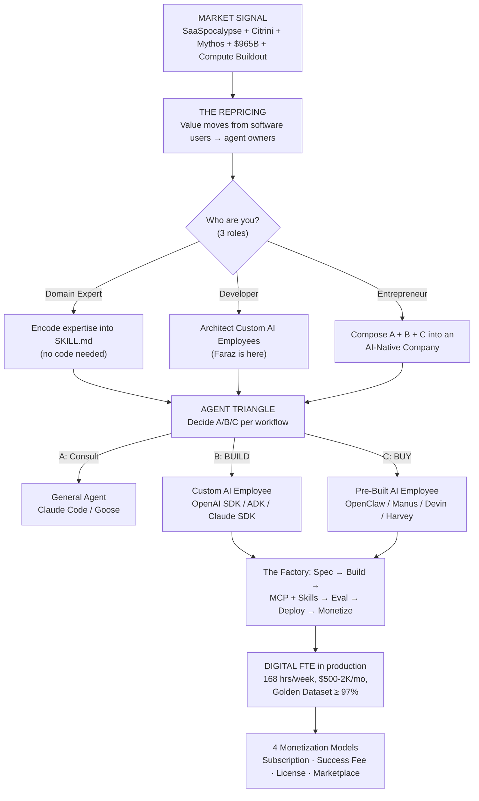

# Preface of Agent Factory — Walkthrough

> **Date:** 2026-06-16
> **For:** Faraz Ahmed — Aptech educator, Spendly owner, on track for Senior Agentic AI Architect (Feb 2027)
> **Sources** (all under `resources/agent-factory/PREFACE The AI Agent Factory/`):
> 1. `PREFACE The AI Agent Factory.md` (strategic / curriculum framing)
> 2. `Preface The Right Side of the Line.md` (market evidence + Four Doors)
> 3. `Agent Factory_ Building Digital Full-Time Equivalents (FTEs).pdf` (deep-dive deck)
> 4. `The New _Agent Triangle_ Classification.pdf` (A/B/C path + OpenClaw)
> 5. `preface-right-side-of-the-line.pdf` (slide-form companion to file 2)
>
> **Companion docs:** `notes/agentic-ai-architect-strategy-2026-06.md` · `notes/part6-nonnegotiables-execution-guide.md` · `CLAUDE.md`
> **How to use this file:** re-open before every Part 6 chapter, every Aptech class on AI, every Spendly architectural decision. Depth > brevity by design — read it in one 15-minute sitting, then keep it within reach.

---

## A. Big Picture in 3 Sentences

In early 2026 the market repriced software: $1T of value left seat-based SaaS in six trading days because autonomous agents can now do the professional work that justified $200/month seats *(Right Side §What Just Happened)*. The Agent Factory is a *practice* — not a product — for turning your domain expertise into role-based AI workers (Digital FTEs) that perform real work continuously, governably, and at scale *(PREFACE §The Agent Factory Vision)*. This book teaches you to occupy the *manufacturing side* of that repricing — building, evaluating, deploying, and monetizing those workers *(Right Side §What This Means for You)*.

---

## B. Why Two Prefaces? What Each Adds

| `PREFACE The AI Agent Factory.md` (strategic preface) | `Preface The Right Side of the Line.md` (evidence preface) |
|---|---|
| **The "what" and "how."** Lays out the Agent Factory vision: two production lines (Build / Buy), the Agent Maturity Model (Incubator → Specialist), the Agent Triangle (A/B/C), MCP + Skills, Digital FTE economics, four monetization models, the Nine Pillars, the Three-Role Partnership, and the "Conductor" paradigm shift. Reads like a curriculum syllabus written as a manifesto. | **The "why now."** Marshals five market signals (SaaSpocalypse · Citrini · $965B Series H · Project Glasswing/Mythos · the $200B compute buildout) to prove the repricing is real, not hype. Frames the entire book as "the map for the people on the *right side* of that repricing." Ends with the **Four Doors In** — Thesis, AI Worker Catalog, Agentic Coding Crash Course, Part 0 "Thinking is the Curriculum." |
| Anchors: Casetext / CoCounsel ($650M) · the Digital SDR case · the Enterprise Architecture Shift table. | Anchors: Anthropic Hit List image · Anthropic-vs-India-IT market-cap comparison · the run-rate chart (5× in 5 months to $47B). |
| Tone: "here is the factory, here is how to operate it." | Tone: "here is why the factory exists at this moment and why your career sits on a knife-edge." |
| **Missing companion:** The first preface references a third slide deck — "Build Your AI Workforce" (the accessible introduction) — for which no PDF was provided. It would have added a softer, no-code on-ramp for domain experts; its absence does not break the walkthrough but is noted here for honesty. |

---

## C. Core Vocabulary, Plain English

Each row: what it means · why it matters · how it shows up in Faraz's world.

| Term | Plain meaning | Why it matters | Spendly / Aptech anchor |
|---|---|---|---|
| **SaaSpocalypse** | The Feb 4–9, 2026 software stock crash where ~$1T evaporated after Anthropic shipped 11 Claude Cowork plugins. | Marks the moment seat-based software was officially repriced as a liability. | The reason "Spendly is a Digital FTE, not a SaaS dashboard" is now the right pitch in 2026. |
| **Digital FTE** | An AI agent that's built, hired, and priced like a human employee — 168 hrs/week, $500–$2K/mo, cloneable. | Lets you charge from HR budgets (salaries), not IT budgets (software). | Spendly is sold as a "Digital Bookkeeper that lives in WhatsApp" — that framing 10×'s pricing vs. "an expense-tracker app." |
| **AI Worker** | The same thing as a Digital FTE, in business-facing language. The "new factor of production." | When pitching to enterprises, say "AI Worker"; when pitching to a CFO, say "Digital FTE." | At Aptech, teach students that the deliverable they're building is a *worker* — not an app. |
| **AI-Native Company** | A company where the workforce is mostly digital and the product is whatever that workforce ships. The org chart inverts: humans supervise, agents execute. | Your one-person startup ceiling just moved up by an order of magnitude. | Spendly is already a 1-person AI-Native business: you supervise; three agents execute the work. |
| **Agent Factory (as practice)** | Not a product. A spec-driven, human-supervised, agent-tool-powered *discipline* for manufacturing AI Workers. | You don't *buy* this; you *adopt* it. | Faraz's entire `tech-guide/` repo is one person's Agent Factory practice. |
| **General Agent** | Reasoning agent (Claude Code, Codex, Goose, Cowork) that observes → orients → decides → acts → corrects (OODA). Code is its universal interface. | The "Trojan Horse" of AI: looks like a coding tool, actually a goal-native digital employee. | Faraz uses Claude Code daily — that's a General Agent in the Incubator role. |
| **Custom-Built AI Employee** | Path B (BUILD). You architect every guardrail, hand-off, and orchestration step using a framework (OpenAI Agents SDK, Google ADK, Claude Agent SDK). | This is *Faraz's* path — Senior Agentic AI Architect = master of Path B. | Spendly's 3-agent pipeline is a Custom-Built AI Employee in flight. |
| **Pre-Built AI Employee** | Path C (BUY). Pre-trained, always-on, multi-channel (OpenClaw, Manus, Devin, Harvey). You onboard, you don't build. | Your competition for low-end work — but also a tool you can deploy *alongside* your custom builds. | At Aptech you'll need to explain to students why a Devin license doesn't kill the case for learning to build. |
| **Agent Triangle** | The three-path decision framework: A (Consultant / General Agent) · B (BUILD / Custom) · C (BUY / Pre-Built). | The first decision in any new engagement: *which corner of the triangle?* Wrong corner = wasted months. | For Spendly: a Build (Path B) anchored by Claude Code consults (Path A) during the build phase. |
| **Agent Maturity Model** | Incubator (General Agents) → Specialist (Custom Agents). You discover with a General Agent, then crystallize into a Specialist when patterns stabilize. | Tells you *when* to graduate from Claude Code experiments to a real SDK build. | You did this: Spendly started as Claude-Code-driven scripts; it's now a Specialist powered by the OpenAI Agents SDK. |
| **Incubator stage** | Stage 1. Raw requirements + General Agent + rapid iteration. Goal: *discover* the solution. | Skipping it = over-engineered solution to the wrong problem. | Aptech students MUST start in the Incubator stage with Claude Code, not jump to writing SDK code. |
| **Specialist stage** | Stage 2. Proven pattern → purpose-built framework → guardrails, orchestration, UI. Goal: *scale and govern* it. | Staying in Incubator forever = no shipped product. | Spendly's Milestone 3 (handoffs, guardrails, sessions, tracing) IS the transition into Specialist stage. |
| **Code as the Universal Interface** | Code isn't just for building software — it's how agents *interrogate reality*. "Why did sales drop in Q3?" → SQL + Python + answer. | Explains why a *coding* tool can do *business* work — and why your Python skills compound. | When you teach Aptech students Python, sell it as the language agents use to ask the world questions. |
| **MCP (Model Context Protocol)** | Universal protocol that connects agents to live data and tools (SQL, CRM, Slack, your filesystem). The "With-What." | Without MCP, an agent is blind to the real world. | Ch.66-67 in Faraz's Tier 1 plan; the planned Spendly MCP server (`query_expenses`/`get_insights`) makes Spendly *consumable by other agents*. |
| **Agent Skill (`SKILL.md`)** | A modular folder of instructions + scripts + resources that teaches an agent a specific repeatable workflow. The "How-To." Reusable IP. | Skills are *portable expertise* — your monetizable asset. | Faraz's `~/.claude/skills/openai-agents-sdk/` is itself an Agent Skill. So is every per-lesson skill he builds. |
| **Spec-Driven Development (SDD)** | Write the spec (Markdown) before the code. The spec becomes an executable blueprint; AI generates code to match. | "In the era of Agents, your Spec is your Source Code." | CLAUDE.md mandates Spec-Kit `/specify` before each lesson. Faraz hasn't been doing it; that's the gap. |
| **Golden Dataset** | A test suite of 50+ real-world scenarios (e.g., "extract tax ID from this messy invoice") your agent must pass with ≥97% accuracy before production. | The Enterprise Gate. No 97% → no enterprise sale. | Spendly's intent-classifier evals (Ch.77 in the Part 6 plan) ARE its Golden Dataset. Without one, Spendly cannot be sold to enterprise. |
| **Encoded Domain Expertise** | Your know-how, written into `SKILL.md` + spec + tools, so an agent can execute it. The thing Thomson Reuters paid $650M for (Casetext/CoCounsel). | The scarce input is no longer "code" — it's *domain*. Faraz already has domain in education. | An "Aptech Programming-Curriculum Agent" that grades projects, tutors students, and generates lessons = encoded expertise = sellable. |
| **Disruption Alpha** | The value gap between dying seat-based SaaS and rising Digital-FTE firms. Captured by the side building the FTEs. | Tells you *which* side of the line your career sits on. | Every per-seat tool your Aptech students currently pay for is a target for displacement by their own future Digital FTEs. |
| **Jobless Boom** | Kochkodin's thesis: GDP rises because of AI infrastructure spend, employment falls because AI does the work. Growth without paychecks. | The macro tension that should make you choose career sides early. | Faraz teaches kids whose jobs may not exist in 5 years — naming this honestly in class is part of the contract. |
| **Three-Role Partnership** | In any session, both you and the AI cycle through three roles: Teacher (you guide via specs; AI explains patterns) · Student (you learn from AI; AI learns your domain) · Co-Worker (AI implements; you orchestrate). | Frames "using Claude Code" as a *relationship*, not a tool call. | When teaching Aptech students, this IS the mental model to install on day one. |
| **Conductor metaphor** | You are no longer the typist. You are the conductor; AI is the orchestra; specs are the score. | Leverage moves from typing speed to clarity of intent. | The reason a 1-person Spendly can compete with a 10-person fintech startup. |
| **Nine Pillars of AI-Native Development** | (1) AI CLIs · (2) Markdown-as-programming · (3) MCP · (4) AI-first IDEs · (5) Linux dev env · (6) TDD + Evals · (7) SDD · (8) Composable Vertical Skills · (9) Cloud-native deployment. | The skills checklist Faraz is grading himself against until Feb 2027. | Cross-reference: every Tier 1 chapter in `part6-nonnegotiables-execution-guide.md` maps to one or two pillars. |
| **Project Glasswing / Claude Mythos** | Anthropic's April 2026 internal model that autonomously discovered thousands of zero-days, solved a 32-step corporate-network attack, scored 73% on expert CTF tasks. Restricted-release. | Proof that a single AI Worker can now outperform an elite human security team — not faster, *better*. | The "what an AI Worker can do that humans can't" example to use in any pitch. |
| **The "Right Side of the Line" thesis** | The market repriced software; the side that *uses* legacy software lost, the side that *manufactures the agents replacing it* won. Be on the manufacturing side. | Your career thesis in one sentence. | The reason "Senior Agentic AI Architect" is the right title to aim at, not "Senior Backend Engineer." |
| **Four Doors In** | (1) The Thesis · (2) AI Worker Catalog · (3) Agentic Coding Crash Course · (4) Part 0 "Thinking is the Curriculum." | The four free entry points Faraz should send anyone (student, client, friend) curious about the curriculum. | Door 3 = the link Faraz should put in his next Aptech LinkedIn post. |

---

## D. The Concept Map

How the pieces connect, from market shock to deployed Digital FTE:

*(Source synthesis: PREFACE §The Agent Factory Vision, §Agent Landscape, §Four Ways to Monetize; FTE deck pp. on Three Paths + Skill-First Pipeline.)*

---

## E. Timeline of Events That Triggered the Repricing

| Date | Event | What it proved |
|---|---|---|
| **Jun 2023** | Thomson Reuters acquires **Casetext / CoCounsel** for $650M cash; CoCounsel scored 97% on legal evals. | *Encoded domain expertise* is independently monetizable — 3 years before the market caught up. |
| **Jan 30, 2026** | Anthropic ships **11 open-source Claude Cowork plugins** (legal, finance, sales, marketing, data). | Agents can now do the work seat-based SaaS was charging for. |
| **Feb 3–4, 2026** | One legal plugin wipes **$285B** off legal-tech + professional-services in a single session. | One agent ≈ entire vertical's revenue base. |
| **Feb 4–9, 2026** | **SaaSpocalypse:** ~$1T erased over six trading sessions. Thomson Reuters −16%, RELX −14%, Salesforce/ServiceNow −7%. | Market-wide confirmation of the agent thesis. |
| **Feb 23, 2026** | **Citrini Research** publishes 7,000-word hypothetical (dated June 2028). Dow −800, IBM −13%, Datadog/CrowdStrike/Zscaler −9%+. | Market expects the disruption to spread beyond software into all knowledge work. |
| **Mar 11, 2026** | *Time* names Anthropic "most disruptive company in the world." Share of U.S. companies paying for Claude tools: 4% → 20% YoY. | Verdict is no longer just price action — it's institutional. |
| **Apr 14, 2026** | VC term sheets for Anthropic at **$800B** (≈ 3.2× combined market cap of India's top 6 IT services, who employ 1.9M). | 1,000 employees > 1.9M employees, in market-cap terms. |
| **Apr 2026** | **Project Glasswing / Claude Mythos** disclosed: autonomous zero-day discovery (incl. 27-yr OpenBSD bug), 73% on expert CTF tasks, first model to solve 32-step network attack end-to-end. | One AI Worker can do work no human team can match. |
| **Apr 24, 2026** | Google formally commits up to **$40B** equity into Anthropic; $10B deployed same day. | Hyperscalers are *pre-financing the workforce that runs on top of compute*. |
| **May 28, 2026** | **$65B Series H** closes at **$965B** post-money. Annualized revenue **$47B** — 5× in 5 months. $200B Google Cloud commit + 5GW Amazon + 220K GPUs at Colossus 1. | The workforce is being manufactured at national-infrastructure scale, not shipped as a product. |
| **Late May 2026** | Forbes (Kochkodin) — "**Jobless Boom**" framing. | The disruption may not produce a crash — it may produce a quiet decoupling of GDP from employment. |

*(Sources: PREFACE §The Anthropic Wake-Up Call · Right Side §What Just Happened → §Then It Got Industrial · Right Side deck pp. 4–17.)*

---

## F. How This Connects to Faraz's Current Work

| Preface concept | Curriculum part that teaches it | Where it shows up in Spendly | Aptech lesson hook |
|---|---|---|---|
| Digital FTE economics | PREFACE §Digital FTE Value Proposition; revisited Part 10–13 | "Spendly is a Digital Bookkeeper, $X/mo" — your pricing story | Open every AI course with the Human FTE vs Digital FTE table |
| Agent Triangle (A/B/C) | Part 0 Preface; Part 1 (General Agents); Part 6 (Build); future part on Pre-Built | Spendly = Path B; Claude Code = Path A on your dev machine; you'll *demo* Path C with OpenClaw | Have students classify 5 real businesses A/B/C as a homework |
| Incubator → Specialist | Part 1 (Incubator); Ch.34 / Part 6 (Specialist) | You've already crossed: Claude-Code prototypes → OpenAI Agents SDK build | Tell students: never code the Specialist before you've discovered with the Incubator |
| Code as Universal Interface | Part 0; reinforced every coding-agent chapter | Spendly's intent classifier *is* code interrogating reality (a WhatsApp message) | Day-1 demo: ask Claude Code "why are the test grades dropping?" → it writes SQL/Python and answers |
| MCP | Ch.66–67 (Tier 1) | Planned Spendly MCP server: `query_expenses` / `get_insights` | Students build a one-tool MCP server as their first integration project |
| Agent Skill (SKILL.md) | Ch.65 (Claude Agent SDK + Skills); also the openai-agents-sdk skill in `~/.claude/skills/` | Spendly's per-agent skill folders | Final project: each student ships ONE Agent Skill |
| Spec-Driven Development | Part 2; reinforced everywhere via Spec-Kit Plus | CLAUDE.md mandates `/specify` per lesson — you've been skipping it; restart this week | Use Spec-Kit Plus as the *project template* for every Aptech assignment |
| Golden Dataset / Evals | Ch.76 (TDD) + Ch.77 (Evals) — Tier 1, Step 4 in part6 guide | Spendly's intent-classifier test pack — `whatsapp/tests/test_intent_classifier.py` due *this week* (Standing Rule 5) | Pair every student capstone with its own Golden Dataset before grading |
| Build vs Buy | Throughout; explicit in PREFACE §Agent Triangle | When a feature could be served by OpenClaw, ask: *should* you build it? | A 1-page "Build vs Buy memo" assignment for any team capstone |
| Monetization (4 models) | Part 10–13 | Spendly subscription ($X/mo) is Model 1; potential White-Label of Spendly's pipeline to other coaches = Model 3 | Teach students that an agent is not a *project* — it's a *product line* |
| Nine Pillars | Mapped across all 9 Parts | Spendly hits 5/9 today (pillars 1, 3, 7 fully; 6, 9 partially) | Use the Pillars as your *Aptech curriculum scope* — every course covers one |
| Conductor / Three-Role Partnership | Part 0 Preface; reinforced via Claude Code mastery skills | You ARE conducting Spendly: Intent Classifier → Extractor → Insights | Frame student–Claude-Code sessions as a *partnership*, not "using a tool" |

---

## G. The Practical Skills the Prefaces Demand

Restated as "what Faraz must master before Feb 2027," cross-referenced to the Tier 1 chapters in `part6-nonnegotiables-execution-guide.md`:

| Skill (from preface) | Nine-Pillar # | Tier-1 chapter(s) | Proof artifact |
|---|---|---|---|
| Specification writing | 2 + 7 | Spec-Kit Plus practice across Ch.62 L4–L10 | A `/specify` file in `openai-agents-sdk/specs/` per lesson |
| AI collaboration (3-role partnership) | 1 + 7 | Every Claude Code session | LinkedIn post per completed lesson (Standing Rule 4) |
| MCP integration | 3 | Ch.66 + Ch.67 | Published Spendly MCP server |
| Test-driven development + Evals | 6 | Ch.76 + Ch.77 | Spendly eval suite gating prompt/model changes |
| Cloud-native deployment | 9 | Part 7 selective (Ch.79–80, 85, 88, 90) | Spendly on Railway/Render, off ngrok |
| Build vs Buy evaluation | 8 | Step 5 (Ch.61 + Ch.63 skim + portfolio) | "Build vs Buy memo" published as part of portfolio |
| Composable Vertical Skills (`SKILL.md`) | 8 | Ch.65 + Ch.68 | A Spendly `SKILL.md` that grades a financial statement against a personal-budget framework |
| Markdown as programming language | 2 | Reinforced everywhere | Every spec file Faraz writes |
| Linux universal dev environment | 5 | Implicit across Part 6/7 | Spendly running cleanly in WSL/Docker (already true) |

**Gap, named honestly:** *Pillar 6 (TDD + Evals)* is currently at zero artifacts. Standing Rule 5 says start it this week.

---

## H. Five Guiding Questions (answer in your own words)

> Don't read past this section until you can answer at least three of these in plain English. If you can't, the artifact failed — re-read sections C, D, F and try again.

1. **Why is Spendly a Digital FTE rather than a chatbot — and what specifically would have to be true for it to *fail* that test?**
   *(Your answer: ___)*
2. **Where does Spendly sit on the Agent Triangle (A/B/C)? Which decisions of yours, made over the next six months, would *move* it on the Triangle?**
   *(Your answer: ___)*
3. **Explain "Code as the Universal Interface" using one example *from your Aptech students' world* — not from this preface.**
   *(Your answer: ___)*
4. **The prefaces argue the bottleneck moved "from writing code to knowing what to encode." Given that, which of your existing teaching skills is *now your scarcest input* — and which is *worth less* than it was three years ago?**
   *(Your answer: ___)*
5. **If a CEO asks you tomorrow "should we build a custom agent or onboard OpenClaw?" — write the four-sentence answer you would give, citing the Decision Matrix dimensions.**
   *(Your answer: ___)*

---

## I. Open Tensions Worth Sitting With

These are deliberate — the prefaces raise them but don't resolve them. You will need a position on each before Feb 2027.

1. **The "no-code Domain Expert" path vs. your Senior Architect goal.** The prefaces sell domain experts on the idea that *they don't need to code*. But your goal is *Senior Agentic AI Architect* — explicitly the code-heavy path. If the no-code path scales as the prefaces claim, the Architect role becomes scarce *and* high-leverage *and* contested. The risk: spending a year mastering Path B while the market drifts toward Path C (Pre-Built employees). The bet: Path B is where the *moat* is, because Pre-Built agents commoditize and someone has to build the customs that aren't commoditized yet. Worth re-checking quarterly.

2. **Teaching at Aptech in the era of the Jobless Boom.** The Kochkodin thesis says growth and employment decouple. You are teaching students whose future job market may not look like today's. The intellectually honest move is to name this in class and re-anchor the curriculum on *building agents*, not *getting hired*. The trap: pretending nothing has changed because it's uncomfortable.

3. **Build-vs-Buy when OpenClaw is open-source and free.** OpenClaw has 150K+ GitHub stars and is self-hostable. For many Aptech students and small clients, "just deploy OpenClaw + a Skill" beats "build a custom Spendly-style agent." The tension: are you teaching students a skill that's about to be commoditized? The defense: customs *outperform* pre-builts in domain depth — Harvey beats generic OpenClaw in legal; a Spendly-shaped agent beats OpenClaw for Pakistani-rupee personal finance. The proof has to be in the depth of *your* domain encoding.

4. **The SDD mandate vs. your actual practice.** CLAUDE.md mandates Spec-Kit `/specify` before each lesson. You've been skipping it for 9 sessions. The prefaces make SDD non-negotiable ("In the era of Agents, your Spec is your Source Code"). Either restart the discipline this week or remove the mandate from CLAUDE.md — leaving the gap open is worse than either choice.

5. **The ethical question the prefaces wave at but never sit with.** "Encoded domain expertise" is also "the expertise of a particular human, captured and resold without them." When you build the Aptech-Programming-Curriculum Agent, *whose* expertise is encoded — yours? your colleagues'? the textbook authors'? This will surface, sooner than you'd guess, as a labor/credit question with your fellow educators. Have an answer ready.

6. **Compute as the binding constraint.** Anthropic just committed $200B to Google Cloud and took every GPU at Colossus 1. Inference cost is *not* a parameter Faraz controls. The Spendly economics that work at Gemini-Flash prices in 2026 may break under a 2027 capacity squeeze, or — Kochkodin's optimistic case — collapse another 50% on cost. Either way, design Spendly so the model layer is *swappable*. (You're doing this with `set_tracing_disabled` + provider abstraction — keep at it.)

---

## J. Next Action

Continue **Ch.34 L4 (Handoffs)** this session using the dual-track plan in `~/.claude/plans/velvety-noodling-reddy.md` and `notes/part6-nonnegotiables-execution-guide.md` — entry ticket: explain why Spendly's Intent-Classifier → Expense-Extractor is currently *orchestration* (agent-as-tool), and what would change for the user if it became a true `handoff()`.
